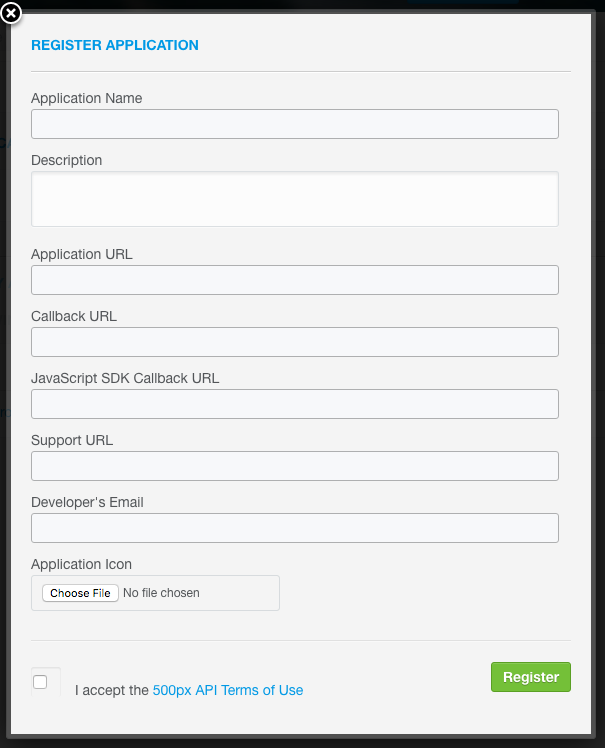

# backdrop

> Screensaver web application feeding on photos from 500px.

## Introduction

Objective of this project is to get familiar with Angular 2 and TypeScript.

Client Frameworks:
* Angular 2 Final Release (TypeScript)
* [Foundation](http://foundation.zurb.com/)

Backend Frameworks:
* Express (TypeScript)

External Resources:
* 500px API

## Getting Started

### Clone Project

```
git clone https://github.com/derekrliang/backdrop.git
cd backdrop
```

### server.json

`server/server.json` is a configuration file of constants required for the server. It is by default ignored by git, so you won't check in your private secrets and keys into a public repository.

``` json
{
    "consumerKey": "QhnUTYnELsMY6s6yLa3iDtlIkGScjL3ZPSIVa21A"
}
```

### Getting 500px Consumer API Key

500px's API is authenticated and require either: 1) consumer key or 2) OAuth. For now, we won't be needing OAuth as we'll be doing simple queries for featured photos that only requires a valid consumer key.

1) You'll need a 500px account before we can get a consumer API key.
2) Head over to your [user settings](https://500px.com/settings) and go to the Applications tab.
3) Register a new application, it should look like this:



4) After you register, you will get a consumer key. Put it in your `server.json` as we'll need it to get photos from 500px.

### Installing Packages

``` bash
npm install
```

## Run Client and Server

``` bash
npm start
```

Visit http://localhost:3000/ and you should see the main page load.

If there are no photos, make sure you have the `consumerKey` properly setup in the `server.json` file.


## Endpoint API

### GET Photos

> Endpoint
>
> http://localhost:3000/photos
>
> Example CURL
>
> CURL -X GET http://localhost:3000/photos
